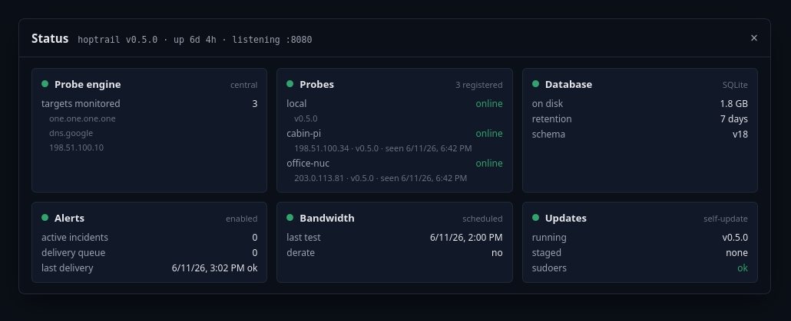
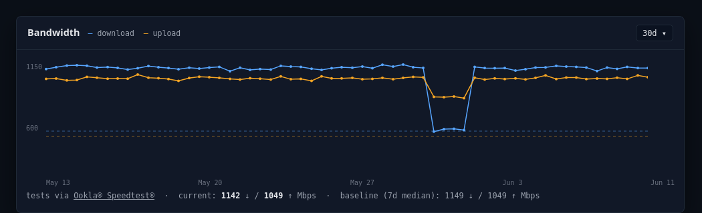
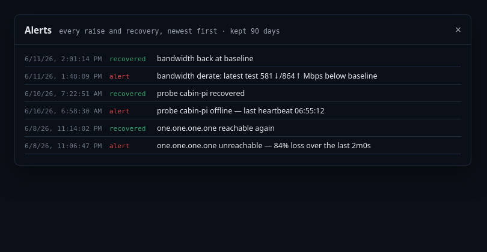
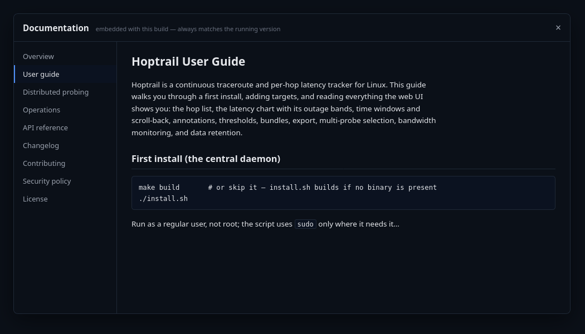

# Hoptrail
<!-- Version: 0.5.0 -->

[](https://opensource.org/licenses/MIT)
[](https://go.dev/dl/)
[](https://www.linux.org/)
[](docs/user-guide.md)

Hoptrail is a continuous traceroute and per-hop latency tracker for Linux.


It is a self-hosted daemon that continuously traces the network path from
your host to one or more targets, persists per-hop latency and loss to
SQLite, and serves a web UI with a hop table, latency timeline, and
bandwidth history. It exists to answer questions about real, continuous
network behavior — "when did this start," "is the slowdown local or
upstream," "which leg of the path is degrading" — rather than the
single-snapshot questions point-in-time tools answer.

## Features

- **Continuous per-hop tracing** — every hop on the path pinged on a
  configurable cadence (default 1s), with loss attribution that
  distinguishes real packet loss from routers that merely deprioritize
  ICMP replies, and ECMP-aware route-change detection that doesn't
  misreport load balancing as flapping.
- **Multi-target tabs** — monitor any number of IPs or hostnames at
  once, each with its own probe interval, latency thresholds, and view
  state. Hostname targets survive CDN IP rotation.
- **A timeline you can investigate with** — scroll back through history,
  zoom with the wheel, brush a focus range to recompute hop statistics
  for a past incident, and pin annotations to moments ("router reboot",
  "called the ISP").
- **Distributed probing** — install lightweight probes at other sites;
  they push measurements to the central over HTTP with automatic
  buffering through outages, and every tab can display any probe's
  vantage point. The diagnostic question shifts from *something is
  degrading* to *which leg is degrading*.
- **Bandwidth monitoring** — scheduled or interval speed tests via the
  operator-installed [Ookla® Speedtest®](https://www.speedtest.net)
  CLI, charted alongside latency with test windows marked on the
  timeline, and automatic alerts when throughput derates below your
  rolling baseline — including the asymmetric case where only upload
  collapses.
- **Shareable evidence** — one-click JSON export of samples, path,
  route changes, and annotations for any window: the "send this to my
  ISP" artifact.
- **Single static binary** — Go daemon with the Svelte UI embedded.
  SQLite storage. No container required, no external services, no
  telemetry.

## Quick start

```bash
git clone https://github.com/preston-peterson/hoptrail.git
cd hoptrail
./install.sh          # builds if needed, installs to /opt/hoptrail, starts the systemd service
```

Open `http://<host>:8080`, add a target, and watch the path appear.
Build requirements: Go 1.22+, Node 18+, and a C toolchain for SQLite
(build host only — the deployed binary is self-contained). The
installer handles the one privileged detail — granting `cap_net_raw`
so the daemon can open a raw ICMP socket without running as root — and
supports the Debian, RPM, Arch, and openSUSE families.

To add a remote probe at another site: gear icon → **Probes** → **Add
probe**. The UI mints a token and hands you the complete install
command to paste on the remote host — no config files, no restart. The
probe appears in the central UI within one heartbeat. See
[distributed probing](docs/distributed-probing.md) for the full
walkthrough.

## More screenshots

| | |
|---|---|
|  |  |
|  |  |

*All screenshots use illustrative data.*

## Documentation

- [User guide](docs/user-guide.md) — install, targets, reading the
  charts, thresholds, annotations, bandwidth monitoring, retention.
- [Distributed probing](docs/distributed-probing.md) — multi-site
  setup, tokens, partition recovery, troubleshooting.
- [Operations](docs/operations.md) — updates, backups, token rotation,
  systemd, the `setcap` gotcha.
- [API reference](docs/api.md) — every endpoint with wire shapes.

## Architecture

```
┌──────────────────┐        ┌────────────────────────┐       ┌──────────────┐
│  Network hops    │───────▶│  Central daemon        │◀──────│  Browser     │
│  (ICMP probes,   │  ICMP  │  (Go + SQLite + UI)    │ HTTP  │              │
│   path discovery)│        └───────────▲────────────┘       └──────────────┘
└──────────────────┘                    │ HTTP push (batches,
┌──────────────────┐        ┌───────────┴────────────┐         heartbeats)
│  Network hops    │───────▶│  Remote probe(s)       │
│  at another site │  ICMP  │  (same binary, no UI)  │
└──────────────────┘        └────────────────────────┘
```

One binary, two roles. The central runs the probe engine, storage,
retention, reverse-DNS, the bandwidth scheduler, and the web UI. Remote
probes run the same engine and push results to the central, spilling to
a local buffer whenever the central is unreachable and draining it on
reconnect — no measurements are lost to an outage.

## What it is not

Hoptrail is not a one-shot diagnostic tool. It is designed to be left
running continuously over days and weeks, with a UI you'd actually keep
open during real work.

Hoptrail is not enterprise observability. There is no multi-tenancy, no
authentication on the web UI, no SaaS, no telemetry. It is a
single-operator tool intended for trusted networks — bind it to
loopback and front it with a reverse proxy if you need it reachable
beyond one.

## Some things hoptrail will not have

No cloud account. No user tracking. No telemetry. No ads. No
subscription. No analytics SDK. No "premium features." It runs on your
hardware, probes from your network, and the data stays local unless you
choose otherwise.

## Project status

Hoptrail is a one-person side project. The code is here because it
might be useful to someone else with the same gap — not because anyone
is building a product or a community.

- **Bug reports are welcome.** File an issue if something is broken;
  expect best-effort response, no SLA, no promises.
- **Pull requests are not accepted.** Hoptrail is
  built the way one person wants it built. If you want to take it
  somewhere different, the MIT license invites you to fork freely —
  that's a feature, not a problem.
- **Feature suggestions** are fine in issues, but the bar for "I'll
  actually build this" is "I want it for myself."

See [CONTRIBUTING.md](CONTRIBUTING.md) for the longer version,
[CHANGELOG.md](CHANGELOG.md) for release notes, and
[SECURITY.md](SECURITY.md) for the threat model and how to report
issues.

## License

[MIT](LICENSE). Use it, fork it, modify it, redistribute it.

Speed tests are performed by the operator-installed Ookla® Speedtest®
CLI under [Ookla's license terms](https://www.speedtest.net/about/eula);
hoptrail does not redistribute it.

## Built on

- **[SQLite](https://www.sqlite.org)** — durable, embedded, perfect at this scale.
- **[`golang.org/x/net/icmp`](https://pkg.go.dev/golang.org/x/net/icmp)** — the ICMP wire layer the probe engine builds on.
- **[Svelte](https://svelte.dev)** + **[uPlot](https://github.com/leeoniya/uPlot)** — the embedded UI and its charts.
