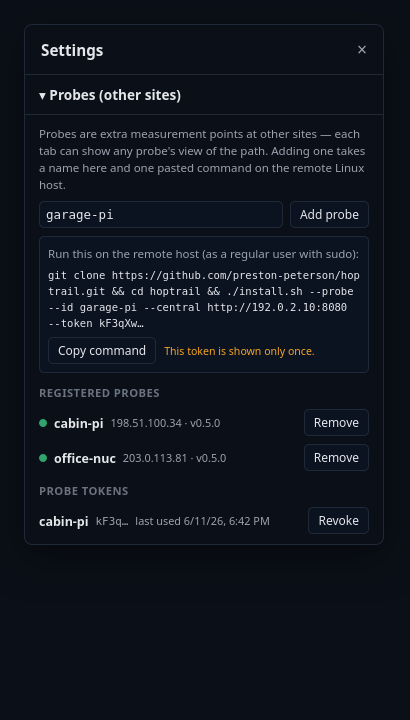

# Distributed Probing

Hoptrail is a continuous traceroute and per-hop latency tracker for Linux.
In a multi-site deployment, hoptrail runs probes from more than one
vantage point and aggregates everything into one central UI — shifting
the diagnostic question from *"is something on the path degrading?"* to
*"which leg of the network is degrading?"* This guide covers the
concepts, adding a probe from the web UI, how targets and data flow,
what happens during a network partition, reading per-probe data in the
UI, and troubleshooting. For single-host usage see
[user-guide.md](user-guide.md); for unit/update/backup mechanics see
[operations.md](operations.md); for the wire protocol see
[api.md](api.md#probes--ingest).

## Concepts

- A **probe** is a measurement vantage point.
- A **deployment** is one **central** plus N probes. The central hosts
  one probe itself, named **`local`** — the central daemon's own on-host
  probe engine. A single-host install is just a deployment with only
  `local`.
- **Remote probes** run on other machines/sites with
  `./install.sh --probe` and the `hoptrail probe` subcommand. They have
  no web UI and no database of their own beyond a small spill buffer:
  they measure locally and **push** results to the central over HTTP
  (`/api/ingest/*`), so they work behind NAT/CGNAT with no inbound ports.
- The **central owns the target set.** Remote probes don't configure
  targets; they receive the list from the central on every heartbeat.
  Add or remove a target in the UI and every probe follows within one
  heartbeat interval (60s by default).

The central's reachable URL is the one thing each probe needs — a LAN
address (`http://192.0.2.10:8080`), or a mesh-VPN address for cross-site
deployments. Plain HTTP is fine on a trusted or mesh-encrypted network;
HTTPS works too.

## 1. Add a probe (from the web UI)



Open the central's UI → gear icon → **Probes** → type a name for the
new probe (kebab-case, e.g. `site-east`) → **Add probe**. The central
mints a bearer token and shows the complete install command for the
remote host, with the token, this central's URL, and the probe's name
already filled in:

```bash
curl -fsSL https://get.hoptrail.net | bash -s -- --probe --id site-east --central http://192.0.2.10:8080 --token <minted-token>
```

Copy it, paste it on the remote Linux host (a regular user with sudo),
done. The command downloads the latest release's prebuilt binary for
the host's architecture (sha256-verified) — no build tools needed on
the probe box. To build from source instead, clone the repo and run
the same `./install.sh --probe …` flags by hand. The token is shown only once — if it's lost, revoke it and add
the probe again. The new token is accepted immediately; nothing on the
central needs editing or restarting.

The central URL in the command is the address **your browser** used to
reach the UI. If the probe will reach the central over a different
route (a mesh-VPN address, say), edit that one value before running.

Revoking is the same panel: each token has a **Revoke** button (the
probe 401s on its next push and spills to its buffer), and each
registered probe has **Remove** to forget its registration. Use one
token per probe — that's what the per-probe revoke is for.

### Manual alternative: yaml tokens

The pre-v0.5 flow still works and suits config-management setups:
generate a token with `hoptrail token gen`, add it under
`probes.tokens` in the central's `config.yaml`, and restart the
central. The accepted token set is the union of the yaml list and the
UI-minted tokens. With neither configured, the ingest surface is
disabled entirely — every ingest request gets a 401 — which is the
right shape for a single-host deploy.

## 2. What the probe install does

The one-liner runs `./install.sh --probe` with the three
deployment-specific values supplied as flags; run it without the flags
and it prompts for them instead. Either way it installs the same
binary (with `cap_net_raw`, same as the central), writes
`/opt/hoptrail/probe.yaml`, and installs the `hoptrail-probe.service`
systemd unit. The three values:

1. **probe_id** (`--id`) — this probe's stable identity. Kebab-case,
   2–32 chars (e.g. `site-east-pi`). The central keys all of this
   probe's data by it, so changing it later orphans history under the
   old name. `local` and `all` are reserved.
2. **central URL** (`--central`) — e.g. `http://192.0.2.10:8080`.
3. **token** (`--token`) — minted in the UI's Probes panel (or by
   `hoptrail token gen` on the yaml path).

Leave any prompt blank to skip: the service is installed but **not
started**, and you edit `/opt/hoptrail/probe.yaml` by hand, then:

```bash
hoptrail check-config --probe --config /opt/hoptrail/probe.yaml
sudo systemctl enable --now hoptrail-probe
```

When the answers are provided, the script validates the config with the
binary's own checker and starts the service. The probe registers itself
in the central's UI (the probe picker in the status bar) within one
heartbeat — no central-side setup beyond the token.

The probe config also carries its own measurement knobs (`interval`,
`discovery_interval`, `max_hops`, `timeout`, `route_change_threshold`) —
the same shape as the central's `probe:` block — plus heartbeat and
ingest cadences. See `probe.yaml.example` for the commented full set.

## How data flows

- **Heartbeat** (default every 60s, and at startup): the probe announces
  its identity, version, and current targets; the central upserts the
  probe's registration and replies with the authoritative target set.
  This is how UI-side target adds/removes propagate — no config edits,
  no push channel, ≤ one heartbeat of delay. A probe that has never
  successfully heartbeated probes nothing (better than probing a stale
  set).
- **Sample ingest** (default every 5s): the probe POSTs the samples and
  route changes buffered since the last successful push. Each batch
  carries a unique, time-sortable `batch_id`; delivery is at-least-once
  and the central deduplicates, so a retry after a lost ack is harmless.
- **Path snapshot** (every discovery sweep, default 30s): the probe
  reports its current view of the path per target. The central stores
  the most recent snapshot per (probe, target) and serves the hop list
  from it.

## Partition recovery

A probe and its central can lose contact for minutes or hours (VPN
flake, ISP outage, central restart). This is handled without data loss
and without operator intervention:

- **During the outage**, every batch that fails to POST spills to a
  small local SQLite buffer on the probe
  (`/var/lib/hoptrail/probe-buffer.db`, 50 MB cap by default — roughly
  14 hours at default cadence). The probe keeps probing the last target
  set it received.
- **If the buffer fills**, the oldest unsent batches are dropped to make
  room, with a WARN in the probe's log.
- **On reconnect**, a flush loop drains the buffer oldest-first, one
  batch at a time, with exponential backoff between failures (up to
  60s). History fills back in on the central as the backlog lands; the
  central's dedup makes replays safe.
- **Offline marking**: a probe that hasn't heartbeated for 3× the
  default heartbeat interval (180s) shows an offline dot in the UI. Its
  historical data stays queryable; the dot flips back on the next
  heartbeat.
- **Timestamps** are probe-local and authoritative; the central never
  adjusts them. Skew between sites is information you want to see.

## Reading per-probe data in the UI

Once a second probe registers, the **probe picker** appears in the
status bar. It selects whose measurements the active tab displays —
chart, hop list, route changes, and export all follow. The selection is
stored on the tab server-side, so different tabs can watch the same
target from different sites side by side.

Notes on remote-probe views:

- The hop list for a remote probe is its **last reported snapshot**, not
  a live engine; the UI surfaces the snapshot time so you can judge
  staleness.
- Reverse-DNS names and the ok/suspect/rate_limited loss classification
  are computed on the central, so hop lists render identically
  regardless of which probe measured them.
- Exports carry a `probe_id` field so a shared file says which site it
  came from.

## Troubleshooting

**The probe service crash-loops and the log shows 401s.**
This is the designed token-failure mode, made loud on purpose: on the
first 401 the probe stops probing and exits non-zero; systemd restarts
it; it 401s again. The loop is visible in
`systemctl status hoptrail-probe`. Causes: the token was revoked in
the UI's Probes panel, the probe's `central.token` has a typo, or — on
the yaml path — the token isn't in `probes.tokens` (or the central
wasn't restarted after adding it; UI-minted tokens need no restart).
Fix the token on whichever side is wrong and restart.

```bash
sudo journalctl -u hoptrail-probe -n 50
```

**The probe shows an offline dot in the picker.**
No heartbeat in the last 180s. Check that `hoptrail-probe` is running on
the remote host, that the central URL is reachable from there
(`curl http://192.0.2.10:8080/api/version`), and the probe's journal for
connection errors. Historical data is unaffected; the dot recovers on
the next heartbeat.

**The central log shows "clock skew rejected" and batches get 400s.**
The central rejects sample timestamps more than 24 hours from its own
clock in either direction — the "probe's NTP is broken" tripwire.
Rejected batches are dropped by the probe (4xx means don't retry), so
fix time sync on the probe (or the central) before the gap grows:

```bash
timedatectl status
```

**Nothing appears for a new probe even though it's online.**
The probe only probes the central's target set. If the central has no
targets, the probe heartbeats happily and measures nothing — add a
target in the UI. Also note the remote hop list needs one discovery
sweep (~30s) after the first heartbeat before a snapshot exists.
