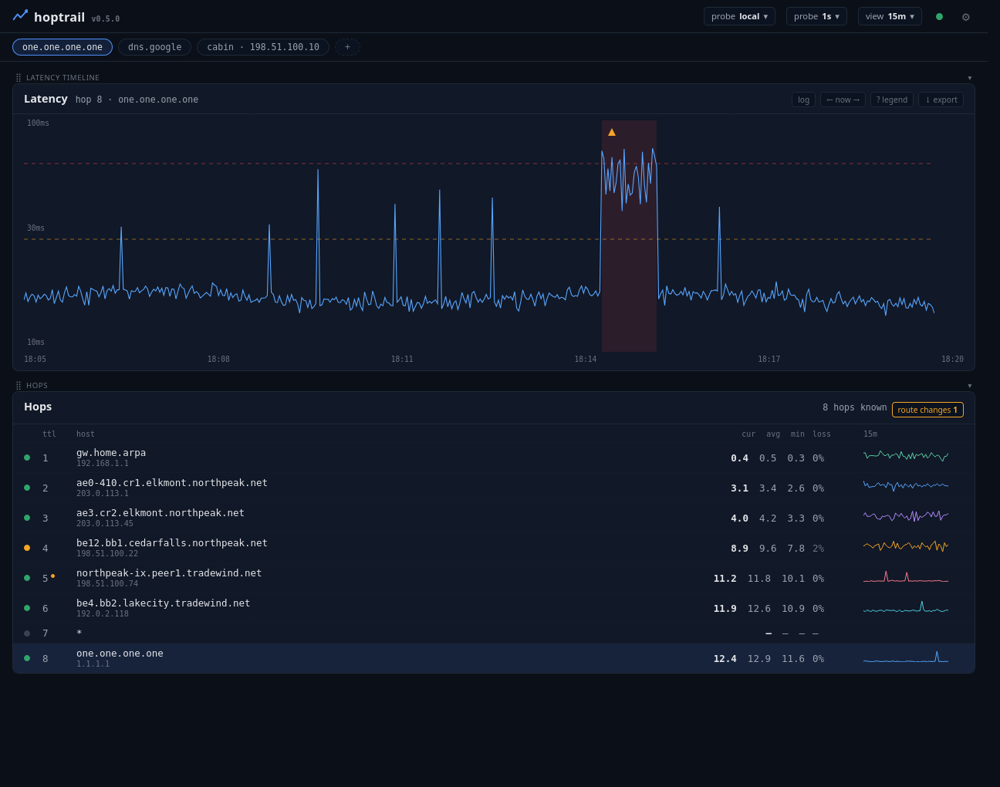

# Hoptrail User Guide

Hoptrail is a continuous traceroute and per-hop latency tracker for Linux.
This guide walks you through a first install, adding targets, and reading
everything the web UI shows you: the hop list, the latency chart with its
outage bands, time windows and scroll-back, annotations, thresholds,
bundles, export, multi-probe selection, bandwidth monitoring, and data
retention. For multi-site setups see
[distributed-probing.md](distributed-probing.md); for day-2 operations
(updates, backups, logs) see [operations.md](operations.md); for the raw
HTTP surface see [api.md](api.md).



## First install (the central daemon)

From the release directory (or a checkout):

```bash
make build       # or skip it — install.sh builds if no binary is present
./install.sh
```

Run as a regular user, not root; the script uses `sudo` only where it
needs it. It installs the binary to `/opt/hoptrail/bin/hoptrail`, grants
it `cap_net_raw` (so it can open raw ICMP sockets without running as
root), creates `/var/lib/hoptrail/` for the SQLite database, writes
`/opt/hoptrail/config.yaml` from the example if one doesn't exist, and
installs and starts the `hoptrail` systemd service running as you.

When it finishes it prints the UI address — typically:

```
Web UI:  http://192.0.2.10:8080
```

Open that in a browser. A fresh install boots into an empty state with no
tabs: nothing is probed until you add a target.

If you want bandwidth monitoring (see below), the installer offers to
install the Ookla® Speedtest® CLI during this run; you can also add it
later with `./install.sh --add-bandwidth`.

## Adding targets and tabs

Click the **+** pill in the tab row and type a target — an IPv4 address
(`8.8.8.8`) or a hostname (`dns.google`). Hostnames are resolved when you
add them; IPv6 isn't supported. The daemon starts a probe pipeline for the
target immediately: a path-discovery sweep finds the hops (every 30s by
default) and a per-hop pinger measures each one (every 1s by default).

A **tab** is a view; a **target** is a probe stream. Multiple tabs can
show the same target with different display settings (time window,
thresholds, label, probe selection). Tab affordances:

- Click a pill to switch tabs.
- **⧉** (on hover) duplicates a tab — same target, same probe stream, an
  independent view.
- Rename a tab by editing its label; a blank label falls back to the
  target string.
- Drag pills to reorder; the order is stored server-side, so every
  browser sees the same tab row.
- **×** closes a tab. Closing the *last* tab for a target also stops
  probing that target — "remove a target" is "close all its tabs."

Probe-affecting settings (probe interval, final-hop-only) belong to the
target and are shared by every tab showing it; display settings
(thresholds, time window, focus, label, probe selection) are per-tab.

### Re-adding a target: resume vs. start new

If you add a target that has prior history in the database, hoptrail asks
before creating the tab:

- **resume** — keep the history. The chart shows an honest gap for the
  span the target wasn't monitored.
- **start new — delete history** — wipes the target's samples and route
  changes (across all probes) and starts clean. Annotations survive; they
  are operator notes, not measurements.

## Reading the hop list

Each row is one hop (TTL) on the path:

- **IP / hostname** — the hop's current IP, with its reverse-DNS name when
  the background rDNS worker has resolved one. A hop that never responds
  shows `*` (anonymous).
- **cur / avg / min** — RTT in milliseconds over the recent window
  (roughly the last 5 minutes at a 1s interval). `min` is the baseline:
  read `cur` and `avg` against it to judge "about as good as usual" vs
  "noticeably slower right now."
- **loss %** and its **state**. Hoptrail classifies loss with a
  downstream-persistence rule, because routers commonly rate-limit their
  own ICMP replies while forwarding traffic perfectly:
  - `ok` — no loss worth flagging.
  - `suspect` — the loss persists at every downstream hop, so this hop is
    likely genuinely dropping traffic. The UI alarms on it.
  - `rate_limited` — the loss vanishes downstream. The hop is declining
    to answer pings, not dropping your traffic. The percentage is shown
    but visually de-emphasized.
- A per-hop **sparkline** shows the recent trend at a glance.

Above the hop list, a diagnostic banner appears when the path matches a
known pattern — e.g. uniform loss at every hop (points at local
hardware), a clean-to-bad transition at a network boundary (upstream
peering), or sawtooth latency on the destination (bandwidth saturation).
It renders nothing when there's nothing to say.

**Route changes** show up inline, with their hop: a "route changes"
button at the right of the Hops header lights up with a count whenever
hops changed IP within the visible time window (scroll back through an
incident and it lights up for that era). Toggle it on and each affected
hop grows indented sub-rows — time, old IP → new IP, newest first —
while affected hops carry a small amber dot even when it's off. The
toggle is saved on the tab, so it follows you across browsers. With
the toggle on, a **clear** button appears beside it — it deletes the
target's route-change history outright (all probes, all time;
two-click confirm). ECMP load-balancing is filtered out: a change is
only flagged after the new IP is seen several consecutive times
(configurable, default 5).

## Arranging the dashboard

Every section (latency timeline, bandwidth, hops) has a slim bar above
it with a ⣿ grip: drag it to reorder the stack, or drop it on the
dashed "dock left"/"dock right" strip that appears at the screen edge
mid-drag to pin it as a vertical side column. The chevron on each bar
collapses a section to just its bar. The main stack scrolls the page;
the dock stays pinned. One layout, saved server-side, shared by every
browser.

## The latency chart

The chart shows **one hop at a time** — the one selected in the hop list
(the destination by default). Click another hop row to switch. The Y axis
defaults to log scale; a toggle switches to linear. Timeouts render as
gaps in the line, never as zero values.

**Outage bands** — translucent red/orange/yellow vertical bands — mark
spans where the selected hop was losing responses. The same
rate-limiting attribution applies: a hop showing loss while everything
downstream is healthy gets no band.

**Threshold lines** — two horizontal reference lines (warning and
critical) painted from the tab's thresholds (next section).

### Time windows

The `view` picker in the status bar selects the window: 5m, 15m, 30m, 1h,
6h, 12h, 24h, or 7d. Shorter windows poll faster; the 7d view is
server-side downsampled so it stays quick. The window is a per-tab
setting. Windows wider than your retention policy still work — they just
can't fill completely, and the picker marks them.

### Scroll-back

The **← / now / →** controls in the chart header pan through history.
Each click moves by half the current window. While panned back the chart
is in "past mode" (with a timestamp badge); **now** snaps back to live.
Plain click-drag on the chart also pans.

### Focus area

To compute hop stats over a specific moment instead of the live window:

- **Double-click** the chart to set a focus window centered on that point
  (width selectable: 15s, 60s, 5m, 30m, 1h), or
- **Shift+drag** to brush an exact range.

The focus area renders as a translucent overlay, and the hop list switches
to stats computed from that window — a "focused" badge marks the mode.
Click the **×** on the focus badge to return to live stats. Focus changes
what stats are displayed, not what data is collected.

### Annotations

Annotations are short notes (up to 280 characters) pinned to a moment on
the timeline — "rebooted the router," "ISP ticket opened." Add one with
the note button in the chart header (pins to the current view time), or
**right-click** anywhere on the chart to pin a note at that exact
timestamp. Notes render as ▲ markers; hover to read, and delete from the
hover card. Annotations are stored per-target in the database, are never
pruned by retention, and are included in exports.

## Thresholds and presets

The thresholds picker (chart-card header) sets the warning/critical
reference lines per tab. Presets cover connection classes:

| Preset | Warning | Critical |
|---|---|---|
| LAN | 10 ms | 30 ms |
| Fiber | 30 ms | 100 ms |
| Cable (default) | 100 ms | 300 ms |
| DSL | 200 ms | 500 ms |
| Satellite | 500 ms | 1000 ms |

**Custom…** accepts any positive pair with warning < critical. Because
thresholds are per-tab, two tabs on the same target can judge it against
different bars.

## Probe interval and final-hop-only

The `probe` picker in the status bar sets how often each hop is pinged
for the active tab's target: presets from 0.5s to 10s, or a custom value
between 200ms and 60s. This is a *target* property — every tab showing
the same target shares it — and it persists across restarts.

The **◯ all hops / ◉ dst only** toggle (chart header) switches a target
to final-hop-only mode: the pinger skips intermediate hops and only
probes the destination, cutting outgoing probe traffic by ~95% on long
paths at the cost of per-hop sample density. Path discovery still runs,
so route changes are still detected. Useful for metered or low-bandwidth
links.

## Bundles

Bundles are named tab sets. Open **bundles ▾** next to the **+** pill:

- **save current as…** stores the current tabs (targets, labels,
  thresholds, order) under a name.
- Clicking a saved bundle **replaces** the current tab set with the
  bundle's — handy for switching between, say, a day-to-day layout and a
  debugging layout.
- **×** on hover deletes a bundle.

## Export

The `↓ export` button in the latency chart's card header downloads a single JSON file for the active tab's
target and probe: the current path snapshot, all samples and route
changes in the window, and your annotations. The default window is the
last hour; the file name embeds the target and timestamp. Use it to share
evidence with an ISP or a colleague — it opens in any text editor.

## The probe picker (multi-probe deployments)

When more than one probe is registered (see
[distributed-probing.md](distributed-probing.md)), a `probe` picker
appears in the status bar. It selects whose measurements the **active
tab** displays — chart, hop list, route changes, and export all follow.
The choice is saved on the tab server-side, so it survives reloads and
other browsers. Each entry shows a colored online/offline dot; `local` is
the central daemon's own probe and is always available. With a single
probe the picker hides entirely.

Adding a probe lives in the settings panel: gear icon → **Probes** →
type a name → **Add probe**, then paste the generated install command
on the remote host. The same section lists registered probes (with
remove) and tokens (with revoke). Full walkthrough in
[distributed-probing.md](distributed-probing.md).

## Bandwidth monitoring

Hoptrail can run scheduled speed tests and call attention to ISP
throughput derates — particularly the asymmetric kind where upload drops
to a fraction of baseline while download looks fine.

The measurements come from the **Ookla® Speedtest® CLI**
(<https://www.speedtest.net/apps/cli>), a separate program you opt into
installing. Hoptrail itself stays a single binary; it shells out to
`speedtest` and parses the result. The CLI is subject to Ookla's license
terms (non-commercial use); hoptrail passes `--accept-license
--accept-gdpr` on its behalf at the first measurement, so by enabling
the feature you're accepting Ookla's EULA and GDPR terms.

### Enabling

1. Install the CLI: say yes at install time, or run
   `./install.sh --add-bandwidth` later (Debian-family distros are
   installed programmatically; others get manual instructions). The
   daemon re-detects the CLI every 60 seconds — no restart needed.
2. Open the **gear icon** (settings panel) and flip the **Enable**
   toggle. Scheduled tests are OFF by default even with the CLI
   installed; nothing burns data without this explicit step.

**"Run a test now"** works even without enabling — the toggle gates the
schedule, not manual runs. The chart card appears as soon as any sample
exists.

### Cadence modes — and the data cost

Each full test transfers roughly **250 MB** on a gigabit line. Fine on
unmetered fiber; real money on a capped plan. Two scheduling modes:

- **Scheduled times** (default): a list of wall-clock times in your
  timezone, up to 6 per day. Default is one test at 02:00 local —
  off-peak, so the ~30 seconds of link saturation doesn't compete with
  your daytime traffic.
- **Interval**: every N minutes (15–1440). The settings panel shows live
  data-cost math because intervals can torch a data cap in a way six
  daily times never could — every 15 minutes on gigabit is on the order
  of **24 GB/day**.

By default hoptrail pauses ICMP probing while a test runs, so the link
saturation doesn't paint a false latency flap on your own charts
(toggleable if you *want* the latency-under-load signal).

### The derate banner

The headline feature. Each test is compared to a rolling baseline (7-day
median by default; the baseline activates after 7 successful tests).
When a measured direction falls below the derate threshold (default 50%
of baseline), a banner appears above the status bar:

> ⚠ Upload throughput derated: 187 Mbps (baseline 974 Mbps) — detected at
> 09:42, has held for 2h 13m.

It clears automatically when a test comes back healthy. Dismissing it
hides it for the current incident only; the next incident re-raises it.
The **directions** setting controls which directions participate in
derate detection (both directions are always measured and charted —
that's a property of the CLI).

### The bandwidth chart

A second chart card below the latency timeline, with download and upload
lines, baseline and threshold reference lines, and the current/baseline
numbers. It shares the latency chart's time window and scroll-back
anchor, so panning one pans both — correlating "latency got bad" with
"throughput dropped" is the point. Failed tests render as gaps.

## The status dot

A small health dot in the top bar distills the whole environment:
green (all good), amber (bandwidth derate, or alert deliveries backing
up), pulsing red (a probe is offline, an alert incident is active, or
the sudoers rule needs a re-install). Click it for the **status
overlay** — one card per subsystem: probe engine, every probe with
online state and last heartbeat, database size and retention, alert
queue and incidents, bandwidth state, and update/sudoers health.

## Alerts

Hoptrail pushes notifications through [ntfy](https://ntfy.sh): install
the ntfy app on your phone, subscribe to your topic, and the settings
panel's **Alerts** section does the rest. Two transport paths:
**Install a local ntfy server** (one button — hoptrail downloads a
checksum-verified ntfy, sets it up as a service on port 2586, and
prefills the fields; it refuses politely if you already run an ntfy
and tells you to point at that instead) or enter the **server URL,
topic, and optional token** of a server you already have. **Send test
notification** verifies the whole pipeline and works whether or not
alerts are enabled, and the **Phone setup guide** beside it walks
through the app install, server, and subscription with your actual
values ready to copy.

What can alert (each toggleable): a **remote probe going offline**
(and recovering), **sustained loss on a target** (destination loss
above your percent for the sustain duration — blips don't page you),
**latency over a tab's warning/critical line** (reuses the thresholds
you already set; tabs without thresholds never latency-alert), and
**bandwidth derate**. Every alert gets a matching **recovered**
message.

The **bell icon** in the top bar opens the alert history — a running
list of every raise and recovery, newest first, kept 90 days. It
records what happened even when delivery was quiet-hours-buffered or
rate-limited.

Hygiene: a per-incident **cooldown** stops re-alert flapping, a global
**rate limit** caps notifications per hour (recoveries are exempt),
and **quiet hours** hold everything and deliver one summary message
when the window ends — an incident that raised and recovered overnight
reads as a single line. Undelivered notifications queue durably: a
daemon restart or an ntfy outage delays them, never loses them.

## System settings

The panel's **System** section covers the daemon-level knobs: the
listen address (applies on restart — reconnect at the new address if
you change it), the log level (applies immediately), and the
reverse-DNS toggle (restart). A **Restart hoptrail** button applies
pending changes without touching a terminal, and the **Updates**
section below it upgrades the binary the same way — upload, apply,
the daemon restarts itself. None of this requires editing the config
file; values set here override it.

**View logs** (same section) opens the daemon's recent log records in
an overlay — level filter, follow mode, no SSH. It holds the last
~2000 records in memory and resets on restart; `journalctl -u
hoptrail` remains the full history. The log-level control above it
applies live, so flipping to debug mid-incident immediately shows
debug records in the viewer.

## Data retention

The settings panel shows and edits the retention policy (1–3650 days,
default 7). An hourly sweep deletes raw probe samples and route changes
older than the policy; changes take effect on the next sweep without a
restart. Annotations and bandwidth samples are never pruned — they're
small and long-term valuable. The time-window picker marks views that
extend past your retention so you know why a chart goes dark on the left.
